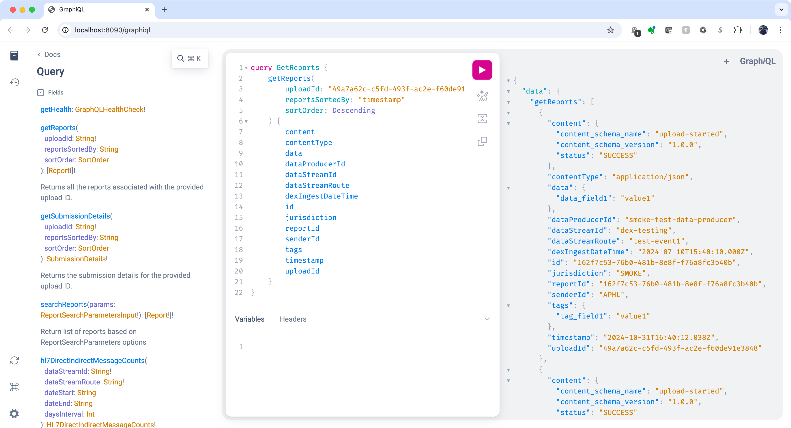

# Public Health Data Observability (PHDO) Processing Status (PS) API

**General disclaimer** This repository was created for use by CDC programs to collaborate on public health related
projects in support of the [CDC mission](https://www.cdc.gov/about/organization/mission.htm).  GitHub is not hosted by the CDC, but is a third party website used by
CDC and its partners to share information and collaborate on software. CDC use of GitHub does not imply an endorsement
of any one particular service, product, or enterprise. 

## Access Request, Repo Creation Request

* [CDC GitHub Open Project Request Form](https://forms.office.com/Pages/ResponsePage.aspx?id=aQjnnNtg_USr6NJ2cHf8j44WSiOI6uNOvdWse4I-C2NUNk43NzMwODJTRzA4NFpCUk1RRU83RTFNVi4u) _[Requires a CDC Office365 login, if you do not have a CDC Office365 please ask a friend who does to submit the request on your behalf. If you're looking for access to the CDCEnt private organization, please use the [GitHub Enterprise Cloud Access Request form](https://forms.office.com/Pages/ResponsePage.aspx?id=aQjnnNtg_USr6NJ2cHf8j44WSiOI6uNOvdWse4I-C2NUQjVJVDlKS1c0SlhQSUxLNVBaOEZCNUczVS4u).]_

## Related documents

* [Open Practices](open_practices.md)
* [Rules of Behavior](rules_of_behavior.md)
* [Thanks and Acknowledgements](thanks.md)
* [Disclaimer](DISCLAIMER.md)
* [Contribution Notice](CONTRIBUTING.md)
* [Code of Conduct](code-of-conduct.md)

## Overview
The Public Health Data Observability (PHDO) Processing Status (PS) API is one tool in the broader PHDO service offering.
It was developed to support public health Data Senders in their effort to share critical public health data with
internal CDC Programs. Data Senders are CDC partners across the country, including:

- State, tribal, local, and territorial public health authorities
- Hospitals and health systems
- Laboratories
- Trusted Intermediaries

PS API is a self-hosted, containerized, and pre-packaged tool for data submission visibility. It is configurable and
can be run both locally and in any cloud environment. PS API was developed to provide visibility into the status and
performance of file uploads. It enables users to request reports about the status of uploads and to develop custom
queries to learn detailed information about the data being uploaded and processed.

## Quick Start
The following Quick Start will help you get up and running quickly to explore basic functionality of the PS API.

### Prerequisites
- **Docker**: See [instructions](https://docs.docker.com/desktop/) for downloading Docker Desktop for Windows, MacOS, and Linux.

### Docker Compose
The PS API can be deployed locally using docker compose, which will create the PS API services and all its
dependencies.  It will also set everything up for you so you can get started quickly.

- Step 1: Clone the repo:
  ```shell
  git clone https://github.com/CDCgov/data-exchange-processing-status.git
  ```
- Step 2: Ensure Docker Desktop is currently running on your machine.
- Step 3: Open a Terminal or PowerShell and navigate to the folder where you placed the above files.
- Step 4: In the Terminal or PowerShell, run docker compose to launch:
  ```shell
  docker compose up –d
  ```
  After a moment you should see the following:
  ```shell
  $ docker compose up -d
   [+] Running 6/6
   ✔ Network pstatus-api_default              Created                                                                                                                                              0.0s
   ✔ Container pstatus-api-couchbase-1        Started                                                                                                                                              0.1s
   ✔ Container pstatus-api-rabbitmq-1         Started                                                                                                                                              0.1s
   ✔ Container pstatus-api-couchbase-setup-1  Started                                                                                                                                              0.1s
   ✔ Container pstatus-api-report-sink-1      Started
   ✔ Container pstatus-api-graphql-1          Started
  ```
- Step 5: Wait about 15 seconds and then verify the services are running in Docker Desktop as shown below. The couchbase-setup service should show that it has Exited since it has completed the setup. Note, RabbitMQ does not require a setup service.
  
- Step 6: You are now ready to start using PS API!  Keep going on the next section to learn how to use GraphQL to read and write reports.

### GraphQL
The `pstatus-api/graphql-1` service running in Docker is your gateway to GraphQL through the
[GraphiQL playground](http://localhost:8090/graphiql).


> **Note**: Postman can also be used for a more rich GraphQL experience.  If using Postman, simply go to _New &#x27A1; GraphQL_ and paste "http://localhost:8090/graphql" in the URL field.

#### Get Health
Paste the following query into your GraphQL (either Postman or the GraphiQL playground).
```graphql
query GetHealth {
    getHealth {
        status
        totalChecksDuration
        dependencyHealthChecks {
            service
            status
            healthIssues
        }
    }
}
```
Run it and you should see an output that looks like this:


#### Create a Report
There are two interfaces for creating reports in PS API:
- Message System
- GraphQL

The supported Message Systems include Azure Service Bus, AWS SNS/SQS, and RabbitMQ.  We are going to create a report using RabbitMQ Message System to show complete end-to-end functionality of the API.

##### Steps:
1. Go to the [Rabbit MQ web app](http://localhost:15672) embedded web app.  The username and password for logging in are:
   - Username: guest
   - Password: guest
2. Navigate to the "Exchanges" tab and select "PSAPIExchange" from the table.  You should see the following:
   
3. Scroll down to the "Publish message" section.
4. Paste "psapi1234" into the "Routing key".
5. Paste the following report into the "Payload".  See the [Reports README](./reports/README.md) for details. 
```json
{
    "report_schema_version": "1.0.0",
    "upload_id": "49a7a62c-c5fd-493f-ac2e-f60de91e3847",
    "user_id": "test-event1",
    "data_stream_id": "dex-testing",
    "data_stream_route": "test-event1",
    "jurisdiction": "SMOKE",
    "sender_id": "APHL",
    "data_producer_id": "smoke-test-data-producer",
    "dex_ingest_datetime": "2024-07-10T15:40:10Z",
    "status": "SUCCESS",
    "disposition_type": "ADD",
    "message_metadata": {
       "message_uuid": "5a1fff57-2ea1-4a64-81de-aa7f3096a1ce",
       "message_hash": "38c2cc0dcc05f2b68c4287040cfcf71",
       "aggregation": "SINGLE",
       "message_index": 1
    },
    "stage_info": {
       "service": "UPLOAD API",
       "action": "upload-started",
       "version": "0.0.49-SNAPSHOT",
       "status": "SUCCESS",
       "issues": null,
       "start_processing_time": "2024-07-10T15:40:10.162+00:00",
       "end_processing_time": "2024-07-10T15:40:10.228+00:00"
    },
    "tags": {
       "tag_field1": "value1"
    },
    "data": {
       "data_field1": "value1"
    },
    "content_type": "application/json",
    "content": {
       "content_schema_name": "upload-started",
       "content_schema_version": "1.0.0",
       "status": "SUCCESS"
    }
}
```
It should look like the following when you're done with these steps.


6. Click the "Publish message" button.
7. Done!  You've just submitted your first PS API report.  Now let's look for it with the queries in the next section.

#### Query Reports
Paste the following query into your GraphQL (either Postman or the GraphiQL playground).

```graphql
query GetReports {
    getReports(
        uploadId: "49a7a62c-c5fd-493f-ac2e-f60de91e3848"
        reportsSortedBy: "timestamp"
        sortOrder: Descending
    ) {
        content
        contentType
        data
        dataProducerId
        dataStreamId
        dataStreamRoute
        dexIngestDateTime
        id
        jurisdiction
        reportId
        senderId
        tags
        timestamp
        uploadId
    }
}
```
> **_Important_**: Replace `uploadId` with the one that you used from the "Create a Report" step above.

Run this query and you should see an output that looks like this:



### Notifications
The PS API Notifications services can be deployed along with the core services using docker compose as well. In order to accomplish this you must have PS API already running which can be done by following the steps outlined in the [Docker Compose](#docker-compose) section. Once the core services are up and running successfully you can run the following to deploy the Notifications services:

- Step 1: Run docker compose with the notifications file specified to launch
  ```shell
    docker compose -f docker-compose.notifications.yml up –d
  ```
    You should see the following:
    ```
    [+] Running 6/6
    ✔ Container temporal-postgresql                                     Started                                                                                                                0.8s 
    ✔ Container temporal                                                Started                                                                                                                1.0s 
    ✔ Container temporal-admin-tools                                    Started                                                                                                                1.5s 
    ✔ Container temporal-ui                                             Started                                                                                                                1.7s 
    ✔ Container pstatus-api-notifications-notifications-rules-engine-1 Started                                                                                                                2.2s 
    ✔ Container notifications-workflow                                  Started
  ```
- Step 2: Verify that all services are running in Docker Desktop or by running `docker ps`.

 
### Next Steps
Please continue to explore in GraphQL for all the types of queries and mutations that can be done.  GraphQL provides a
complete list in the documentation that is grabbed via "introspection" from the PS API GraphQL service.

## Public Domain Standard Notice
This repository constitutes a work of the United States Government and is not
subject to domestic copyright protection under 17 USC § 105. This repository is in
the public domain within the United States, and copyright and related rights in
the work worldwide are waived through the [CC0 1.0 Universal public domain dedication](https://creativecommons.org/publicdomain/zero/1.0/).
All contributions to this repository will be released under the CC0 dedication. By
submitting a pull request you are agreeing to comply with this waiver of
copyright interest.

## License Standard Notice
The repository utilizes code licensed under the terms of the Apache Software
License and therefore is licensed under ASL v2 or later.

This source code in this repository is free: you can redistribute it and/or modify it under
the terms of the Apache Software License version 2, or (at your option) any
later version.

This source code in this repository is distributed in the hope that it will be useful, but WITHOUT ANY
WARRANTY; without even the implied warranty of MERCHANTABILITY or FITNESS FOR A
PARTICULAR PURPOSE. See the Apache Software License for more details.

You should have received a copy of the Apache Software License along with this
program. If not, see http://www.apache.org/licenses/LICENSE-2.0.html

The source code forked from other open source projects will inherit its license.

## Privacy Standard Notice
This repository contains only non-sensitive, publicly available data and
information. All material and community participation is covered by the
[Disclaimer](https://github.com/CDCgov/template/blob/master/DISCLAIMER.md)
and [Code of Conduct](https://github.com/CDCgov/template/blob/master/code-of-conduct.md).
For more information about CDC's privacy policy, please visit [http://www.cdc.gov/other/privacy.html](https://www.cdc.gov/other/privacy.html).

## Contributing Standard Notice
Anyone is encouraged to contribute to the repository by [forking](https://help.github.com/articles/fork-a-repo)
and submitting a pull request. (If you are new to GitHub, you might start with a
[basic tutorial](https://help.github.com/articles/set-up-git).) By contributing
to this project, you grant a world-wide, royalty-free, perpetual, irrevocable,
non-exclusive, transferable license to all users under the terms of the
[Apache Software License v2](http://www.apache.org/licenses/LICENSE-2.0.html) or
later.

All comments, messages, pull requests, and other submissions received through
CDC including this GitHub page may be subject to applicable federal law, including but not limited to the Federal Records Act, and may be archived. Learn more at [http://www.cdc.gov/other/privacy.html](http://www.cdc.gov/other/privacy.html).

## Records Management Standard Notice
This repository is not a source of government records, but is a copy to increase
collaboration and collaborative potential. All government records will be
published through the [CDC web site](http://www.cdc.gov).

## Additional Standard Notices
Please refer to [CDC's Template Repository](https://github.com/CDCgov/template)
for more information about [contributing to this repository](https://github.com/CDCgov/template/blob/master/CONTRIBUTING.md),
[public domain notices and disclaimers](https://github.com/CDCgov/template/blob/master/DISCLAIMER.md),
and [code of conduct](https://github.com/CDCgov/template/blob/master/code-of-conduct.md).
