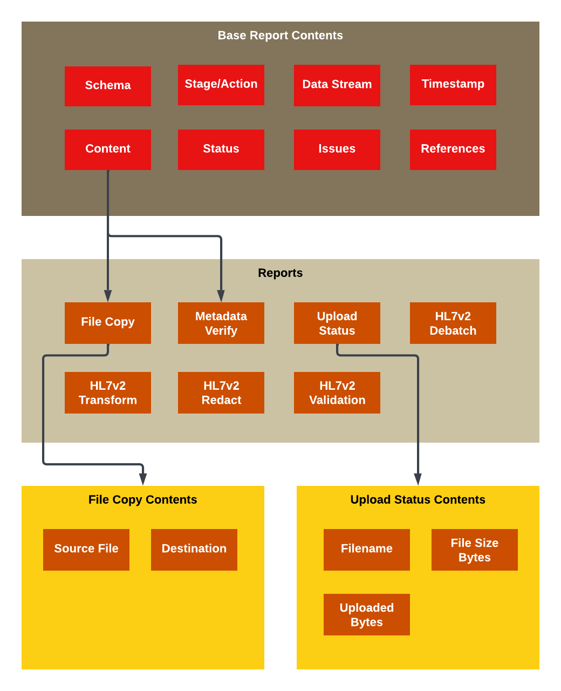

# Overview
Reports are an essential component of the data observability aspect of the CDC Data Exchange (DEX).  In DEX, data is ingested to the system typically through a file upload.  As the upload progresses through the service line processing occurs.  The processing in the service line is made up stages, which can be the upload, routing, data validation, data transformations, etc.  Within each of those stages one or more actions may occur.  Taking the example of upload, one action within the stage may be to first verify that all the required metadata associated with the uploaded file is provided and reject it if not.  Other upload actions may include the file upload itself or the disposition of the upload for further downstream processing.  Reports are provided by both services internal to DEX and downstream of DEX as data moves through CDC systems.  Those services indicate the processing status of these stages through Reports.

# Delivery Mechanisms
Reports may be provided in one of two ways - either through calls into the Processing Status (PS) API as GraphQL mutations or by way of an Azure Service Bus.  There are pros and cons of each summarized below.

| Azure Service Bus   | GraphQL                  |
|---------------------|--------------------------|
| Fire and forget [1] | Confirmation of delivery |
| Fast                | Slower                   |

[1] Failed reports are sent to a Report deadletter that can be queried to find out the reason(s) for its rejection.  When using ASB there is no direct feedback mechanism to the report provider of the rejection.

### GraphQL Mutations
GraphQL mutations are writes to a persisted object.  In the case of PS API, reports are written to PS API as GraphQL mutations.

For context, GraphQL does not require any special client and can be communicated to the same as REST endpoints.  However, unlike REST there is only one endpoint with path `/graphql` and you POST to it.  The main difference is in the request body of the POST.  Below is an example of how a Report would be sent to PS API.

**POST** `{{ps_api_base_url}}/graphql`

Request body:
```graphql
mutation AddReport($report: Report!) {
  addReport(report: $report) {
    reportId
    result
    issues
  }
}
```
In this example, we are asking for the `reportId` of the added report be returned in the response.

Response of accepted report:
```json
{
  "data": {
    "addReport": {
      "reportId": "47286e48-2a22-4e26-930e-c7b4115b0cf1",
      "result": "SUCCESS",
      "issues": null
    }
  }
}
```
Response of rejected report:
```json
{
  "data": {
    "addReport": {
      "reportId": null,
      "result": "FAILURE",
      "issues": [
        "Missing required field, dex_ingest_datetime"
      ]
    }
  }
}
```
> NOTE: With GraphQL, every HTTP status code returned is a 200 unless the request is unauthorized or something fails on the server.  Clients must inspect the `result` field to determine success. 

There will also be a mutation available to replace an existing report.

### Azure Service Bus
Reports may be sent to the PS API Azure Service Bus (ASB) queue or topic.  Below is an example code snippet in Kotlin.

```kotlin
val report = MyDEXReport().apply {
    // set the report fields
}

val senderClient = ServiceBusClientBuilder()
    .connectionString(sbConnString)
    .sender()
    .topicName(topicName)
    .buildClient()

// Send the report to the PS API report topic
senderClient.sendMessage(ServiceBusMessage(report))
```

> Sending reports via the PS API ASB report **queue** is being deprecated.  The PS API report queue will eventually be removed.  Reports should be sent to the PS API report **topic** instead. 

In order to access the ASB from your DEX service there may need be a firewall rule put in place.  If your service is running in Kubernetes then no firewall rule should be necessary.

# Anatomy of a Report
Depending on the delivery mechanism, the anatomy of a report will look a little different. When sending via the Azure Service Bus, one extra parameter may be provided, `disposition_type` which is can be either `add` or `replace`.  If not provided, the default is `add`.  The `disposition_type` field is not needed for GraphQL as the mutation name indicates whether the report is being added or replaced.



## Report Schemas
There are many solutions for defining schemas to ensure interoperability.  One popular solution specific to JSON is [json-schema.org](https://json-schema.org/). While there are many solutions that encompass other formats beyond JSON, the primary report format for DEX is JSON.  As such, to keep things simple we've opted, at least initially for a proof of concept, to move forward with `json-schema.org`.

### Report Base Content
All report base content must be in JSON and every report is required to have a base set of fields.  However, if additional fields are provided in the report base content they will be recorded with the report untouched.

Example:
```json
{
  "report_schema_version": "1.0.0",
  "upload_id": "97f39f33-e64d-4763-96eb-6186f2891777",
  "data_stream_id": "aims-celr",
  "data_stream_route": "hl7",
  "jurisdiction": "TXA",
  "dex_ingest_datetime": "2024-06-19T00:51:08Z",
  "message_metadata": null,
  "stage_info": {
    "service": "routing",
    "action": "blob-file-copy",
    "version": "1.0.3-SNAPSHOT",
    "status": "SUCCESS",
    "issues": null,
    "start_processing_time": "2024-06-10T12:05:10Z",
    "end_processing_time": "2024-06-10T12:05:18Z"
  },
  "content_type": "application/json",
  "content": {
    "content_schema_name": "blob-file-copy",
    "content_schema_version": "1.0.0",
    "file_source_blob_url": "https://source.blob.core.windows.net/...",
    "file_destination_blob_url": "https://destination.blob.core.windows.net/...",
    "timestamp": "2024-06-19T00:51:08Z"
  }
}
```
| Field                   | Description                                                                            | Type                  | Format          | Required |
|-------------------------|----------------------------------------------------------------------------------------|-----------------------|-----------------|----------|
| `report_schema_version` | Report schema version; e.g. 1.0.0                                                      | String                | x.y.z           | Yes      |
| `upload_id`[1]          | Unique upload identifier                                                               | String                | UUID            | Yes      |
| `user_id` [2]           | User id of the person that uploaded the file                                           | String                |                 | No       |
| `data_stream_id`        | Data stream identifier                                                                 | String                |                 | Yes      |
| `data_stream_route`     | Data stream route                                                                      | String                |                 | Yes      |
| `jurisdiction`          | Jurisdiction the report is associated with                                             | String                |                 | No       |
| `dex_ingest_datetime`   | Timestamp of when the file was uploaded                                                | String                | ISO8601         | Yes      |
| `sender_id`             | Unique identifier of the sender of this data which could be an intermediary            | String                |                 | Yes      |
| `data_producer_id`      | Unique identifier of the entity that actually created the data this report pertains to | String                |                 | No       |
| `message_metadata` [3]  | Null if not applicable                                                                 | Object                | JSON Object     | No       |
| `stage_info` [4]        | Describes the stage that is providing this report                                      | Object                | JSON Object     | Yes      |
| `tags` [5]              | Optional tag(s) associated with this report                                            | Map(String to String) |                 | No       |
| `data` [6]              | Optional data associated with this report                                              | Map(String to String) |                 | No       |
| `content_type`          | MIME content type of the content field; e.g. JSON, XML, PDF, etc [7]                   | String                |                 | Yes      |
| `content`               | Content of the report                                                                  | Object or String      | JSON Object [8] | Yes      |

[1] It has been suggested we rename `upload_id` to `transport_id`, ostensibly to cover the case where the upload API is bypassed and files come in through a FHIR subscription or some other means.  Although, `transport_id` is a more generic term, I'm hesitant to rename it as `upload_id` is pretty ubiquitous in its use through the system.

[2] The `user_id` field will originate from the Upload API and recorded in the blob file properties.

[3] The `message_metadata` may be null if not applicable.  If provided the definition is as follows:

| Field           | Description                           | Type    | Format | Required |
|-----------------|---------------------------------------|---------|--------|----------|
| `message_uuid`  | Unique ID of the message              | String  | UUID   | No       |
| `message_hash`  | MD5 hash of the message content       | String  |        | No       |
| `aggegration`   | Enumeration: [SINGLE, BATCH]          | String  | Enum   | No       |
| `message_index` | Index of the message; e.g. row if csv | Integer |        | No       |

[4] The `stage_info` format is expected to be a JSON Object with the following fields.

| Field                   | Description                                                | Type               | Format  | Required |
|-------------------------|------------------------------------------------------------|--------------------|---------|----------|
| `service`               | Name of the service associated with this report            | String             |         | Yes      |
| `action`                | Action the stage was conducting when providing this report | String             |         | Yes      |
| `version`               | Version of the stage providing this report                 | String             |         | No       |
| `status`                | Enumeration: [SUCCESS, FAILURE]                            | String             | Enum    | Yes      |
| `issues` [4a]           | List of issues, null if status is success                  | Array(JSON Object) |         | No       |
| `start_processing_time` | Timestamp of when this stage started work                  | String             | ISO8601 | Yes      |
| `end_processing_time`   | Timestamp of when this stage finished work                 | String             | ISO8601 | Yes      |

[4a] The `issues` format is expected to be an array of JSON Objects.  If not null, the array element shall have the following structure.

| Field     | Description                                                                                 | Type    | Format | Required |
|-----------|---------------------------------------------------------------------------------------------|---------|--------|----------|
| `level`   | Enumeration: [WARNING, ERROR]                                                               | String  | Enum   | Yes      |
| `message` | Description of the issue that may also optionally include possible remediation instructions | String  |        | Yes      |

[5] The `tags` field is optional and if provided shall contain the following format.

Example:
```json
{
  "tags": {
    "HL7v2 structure validation version": "3.4.2"
  }
}
```

[6] The `data` field is optional and if provided shall contain the following format.

Example:
```json
{
  "data": {
    "blob_url": "https:<ACCOUNT>.blob.core.windows.net/<PATH>/<FILENAME>?<SIGNATURE>"
  }
}
```

[7] Content types should be [MIME types](https://www.iana.org/assignments/media-types/media-types.xhtml).  For example, for JSON `content_type` = `application/json`.  For backward compatibility, `json` is also accepted.

[8] The `content` format is expected to be a JSON Object if  `content_type` is `application/json`.  Otherwise, no particular format is expected as it will be interpreted as a base64 encoded string.

### Notes around `user_id`, `sender_id`, and `data_producer_id`
- The `user_id` field is not the same as the `sender_id` field.
- When a user uploads a file from the DEX Portal, `user_id` will be the id of the user logged in and `sender_id` will be `portal`.
- When a file is uploaded from an intermediary, `user_id = null`, `sender_id` will be the id of the intermediary, such as `IZGW`.
- When a data provider is directly uploading a report, `user_id = null` and `sender_id` = `data_producer_id`.

### Report Acceptance
When a report is accepted, two new fields will be added when the report is persisted:
- `report_id`: Generated UUID of the report.
- `timestamp`: Timestamp of when the report was accepted and written to the database.

### Base Report Schema
The base report schema is the basis of every report.  All reports must include it.  It's analogous to an open base class in object-oriented design.  See [this link](base.1.0.0.schema.json) for an example schema definition of the base report using json-schema.org.

### Concrete Report Schemas
When `content_type = json`, the `content` will be interpreted as JSON and from within `content` the `content_schema_name` and `content_schema_version` will be inspected.  We will use these two values to lookup a matching schema definition for further validation of the report's content.

Example:
```json
{
  "content_type": "json",
  "content": {
    "content_schema_name": "blob-file-copy",
    "content_schema_version": "1.0.0",
    "file_source_blob_url": "https://source.blob.core.windows.net/...",
    "file_destination_blob_url": "https://destination.blob.core.windows.net/...",
    "timestamp": "2024-06-19T00:51:08Z"
  } 
}
```
In the example above, the `content_schema_name` is `blob-file-copy` and the `content_schema_version` is `1.0.0`.  The PS API report validation will look for the schema definition file corresponding to these values and run validation.  The file will be named, `blob-file-copy.1.0.0.schema.json`.
An example of this report schema is pasted below.  
```json
{
  "$schema": "https://json-schema.org/draft/2020-12/schema",
  "$id": "https://github.com/cdcent/data-exchange-messages/reports/blob-file-copy",
  "title": "Blob File Copy Report",
  "type": "object",
  "required": ["content_schema_name", "content_schema_version", "file_source_blob_url", "file_destination_blob_url"],
  "properties": {
    "content_schema_name": {
      "type": "string"
    },
    "content_schema_version": {
      "type": "string"
    },
    "file_source_blob_url": {
      "type": "string",
      "description": "URL of the source blob file to be copied."
    },
    "file_destination_blob_url": {
      "type": "string",
      "description": "URL of destination blob file."
    },
    "timestamp": {
      "type": "string",
      "format": "date-time",
      "description": "Timestamp of when the file copy was executed."
    }
  }
}
```

> If a corresponding `content_schema_name` and `content_schema_version` schema definition file is not found the report will be rejected.  

### Report Content
All DEX internal service shall provide their **report content** in JSON.  Report content is highly encouraged to be JSON with downstream processing partners, but it does not have to be.  The `content_type` field indicates the format of the content.

If partners using DEX have downstream processing and want to provide **report content** in XML, PDF or some other format they may.  If a partner provides any content format other than JSON it will be recorded in the `content` field as a base64 encoded string.

| Report Type                     | Schemas Available                                                              | Latest Version | Used by service / action                |
|---------------------------------|--------------------------------------------------------------------------------|----------------|-----------------------------------------|
| base                            | [schema.0.0.1](base.0.0.1.schema.json), [schema.1.0.0](base.1.0.0.schema.json) | 1.0.0          | all / all                               |
| metadata-verify                 | [schema.1.0.0](metadata-verify.1.0.0.schema.json)                              | 1.0.0          | upload api / metadata-verify            |
| metadata-transform              | [schema.1.0.0](metadata-transform.1.0.0.schema.json)                           | 1.0.0          | upload api / metadata-transform         |
| upload-status                   | [schema.1.0.0](upload-status.1.0.0.schema.json)                                | 1.0.0          | upload api / upload-status              |
| upload-started                  | [schema.1.0.0](upload-started.1.0.0.schema.json)                               | 1.0.0          | upload api / upload-started             |
| upload-completed                | [schema.1.0.0](upload-completed.1.0.0.schema.json)                             | 1.0.0          | upload api / upload-completed           |
| blob-file-copy                  | [schema.1.0.0](blob-file-copy.1.0.0.schema.json)                               | 1.0.0          | routing / file-copy, upload / file-copy |
| hl7v2-debatch                   | [schema.1.0.0](hl7v2-debatch.1.0.0.schema.json)                                | 1.0.0          | hl7v2 / receiver                        |
| hl7v2-redact                    | [schema.1.0.0](hl7v2-redact.1.0.0.schema.json)                                 | 1.0.0          | hl7v2 / redactor                        |
| hl7v2-structure-validation      | [schema.1.0.0](hl7v2-structure-validation.1.0.0.schema.json)                   | 1.0.0          | hl7v2 / structure-validator             |
| hl7v2-json-lake-transformer     | [schema.1.0.0](hl7v2-json-lake-transformer.1.0.0.schema.json)                  | 1.0.0          | hl7v2 / json-lake-transformer           |
| hl7v2-lake-segments-transformer | [schema.1.0.0](hl7v2-lake-segments-transformer.1.0.0.schema.json)              | 1.0.0          | hl7v2 / lake-segments-transformer       |
| buzz-file-capture               | [schema.1.0.0](buzz-file-capture.1.0.0.schema.json)                            | 1.0.0          | buzz app                                |

# Validation
The PS API will perform the following workflow for validation.
1. Open the report content as JSON and attempt to read the `report_schema_version` fields.  If the content is not JSON, malformed JSON or the `report_schema_version` field is missing or empty, the entire report will be rejected.
2. Lookup the schema definition file corresponding to `base.<report_schema_version>.schema.json`.  If the file is not found, the report is rejected.
3. Validate the base report content against the base report schema.  If the validation fails, the report is rejected.
4. Determine if the `content_type` is JSON.  If so, open the `content` as JSON and attempt to read both the `content_schema_name` and `content_schema_version` fields within `content`. If the content is not JSON, malformed JSON or either of these fields are missing or empty, the entire report will be rejected.
5. Lookup the schema definition file corresponding to `<content_schema_name>.<content_schema_version>.schema.json`.  If the file is not found, the report is rejected.
6. Validate the `content` of the report against the provided report schema.  If the validation fails, the report is rejected.
7. Report is accepted and recorded.

## Scope of Validation
Verifying that a particular service and/or action is using an expected report schema is not part of the report validation.  If extra report fields are provided they will not cause the validation to fail.  Rather, those fields and their values will be recorded verbatim along with the rest of the report.

## Validation Library
PS API is written in Kotlin.  There are a number of schema validation toolsets available in Java/Kotlin as listed [here](https://json-schema.org/implementations#validators-java).  For the proof of concept, the PS API will utilize [json-schema-friend](https://github.com/jimblackler/jsonschemafriend).

## Rejected Reports
A report may be rejected for any one of the following reasons:
- Malformed JSON; e.g. syntax errors, duplicate fields/keys in JSON
- The validation did not pass, such as due to missing required fields
- No corresponding report schema definition found (received an unknown report schema name/version)

When a report is rejected the handling of it will depend on the delivery mechanism. If the report was sent via GraphQL, then the GraphQL response will indicate the reason the report was rejected.  However, if the report was sent via ASB the report will be placed into the report deadletter.  Report deadletters are accessible through the GraphQL query interface.

# Report Queries
Reports will be queried with a GraphQL interface in the PS API.  Given that, queries can be combined into one allowing multiple query results to be provided at once.  In addition, fields within those queries can be included or excluded as needed. 

## Data Projections
The PS API has a number of GraphQL queries available.  Some of the queries are basic and require little or no transformation or aggregation of data.  However, the ones that are more sophisticated are called, data projections.  Some of the data projections available, namely the ones immediately of interest to the Portal team will be defined below.

Data projections are not defined by schemas in the way that reports are.  The definition of GraphQL responses is defined by GraphQL and can be interrogated by introspection.  The introspection is analogous to REST swagger documentation where the input parameters, their description, and the output results are defined within the source code.

### Submissions List

GraphQL Request:
```graphql
query GetUploads($dataStreamId: String!, $dataStreamRoute: String!, $dateStart: String?, $dateEnd: String?, $filename: String?, $sortBy: String?, $sortOrder: String?) {
  uploads(
    dataStreamId: $dataStreamId
    dataStreamRoute: $dataStreamRoute
    dateStart: $dateStart
    dateEnd: $dateEnd
    filename: $filename
    pageSize: 20
    pageNumber: 1
    sortBy: $sortBy
    sortOrder: $sortOrder
  ) {
    summary {
      numberOfPages
      pageNumber
      pageSize
      totalItems
      jurisdictions
      senderIds
    }
    items {
      uploadId
      fileName
      bytesUploaded
      fileSizeBytes
      percentComplete
      jurisdiction
      senderId
      status
      issues
      metadata
      timeUploadingSec
      timestamp
    }
  }
}
```
Input parameters:
- `sortBy`: Optional and if provided can be:
- `sortOrder`: Optional and if provided can be `asc` or `desc`.  Default is `desc`.
- `filename`: Optional and if provided will filter responses for the given filename

Output values:
- `summary.jurisdictions`: Array of all values of jurisdictions in this dataset
- `summary.senderIds`: Array of all values of senderIds in this dataset
- `items.jurisdiction`: Jurisdiction associated with this upload
- `items.senerId`: Sender ID associated with this upload
- `items.status`: Overall status of the upload, which is an enum of [ `FAILED`, `PROCESSING`, `DELIVERED` ].
  - Status is `FAILED` if the status of any of the upload actions have failed.
  - Status is `PROCESSING` if none of the upload actions are failed or delivered.
  - Status is `DELIVERED` if at least one blob file copy report exists and is successful.

GraphQL Response:
```json
{
  "data": {
    "uploads": {
      "summary": {
        "pageNumber": 1,
        "numberOfPages": 1,
        "pageSize": 20,
        "totalItems": 7,
        "jurisdictions": [ "TX", "AL" ],
        "senderIds": [ "izgw", "portal" ]
      },
      "items": [
        {
          "status": "FAILED",
          "filename": "some_upload1.csv",
          "upload_id": "933e7f15-67ab-4ab7-979c-b7f58870f483",
          "jurisdiction": "TX",
          "sender_id": "izgw",
          "metadata": {
            "meta_field2": "value3"
          },
          "issues": [
            "Missing required metadata field, 'meta_field1'.",
            "Metadata field, 'meta_field2' is set to 'value3' and does not contain one of the allowed values: [ 'value1', value2']"
          ],
          "timestamp": "2024-03-21T22:03:39.469Z"
        },
        {
          "status": "PROCESSING",
          "percent_complete": 0.0,
          "filename": "some_upload1.csv",
          "file_size_bytes": 27472691,
          "bytes_uploaded": 5462,
          "upload_id": "1d4ea7e7-4190-4f8c-b874-b5a6235e8f15",
          "jurisdiction": "AL",
          "sender_id": "portal",
          "time_uploading_sec": 1.065,
          "metadata": {
            "filename": "10MB-test-file",
            "filetype": "text/plain",
            "meta_destination_id": "ndlp",
            "meta_ext_event": "routineImmunization",
            "meta_ext_source": "IZGW",
            "meta_ext_sourceversion": "V2022-12-31",
            "meta_ext_entity": "DD2",
            "meta_username": "ygj6@cdc.gov",
            "meta_ext_objectkey": "2b18d70c-8559-11ee-b9d1-0242ac120002",
            "meta_ext_filename": "10MB-test-file",
            "meta_ext_submissionperiod": "1"
          },
          "timestamp": "2024-03-08T23:38:21.493Z"
        },
        {
          "status": "DELIVERED",
          "percent_complete": 100.0,
          "filename": "some_upload1.csv",
          "file_size_bytes": 27472691,
          "bytes_uploaded": 27472691,
          "upload_id": "e4361c73-348b-46f2-aad8-3043f8922f1d",
          "jurisdiction": "TX",
          "senderId": "izgw",
          "time_uploading_sec": 4.312,
          "metadata": {
            "filename": "10MB-test-file",
            "filetype": "text/plain",
            "meta_destination_id": "ndlp",
            "meta_ext_event": "routineImmunization",
            "meta_ext_source": "IZGW",
            "meta_ext_sourceversion": "V2022-12-31",
            "meta_ext_entity": "DD2",
            "meta_username": "ygj6@cdc.gov",
            "meta_ext_objectkey": "2b18d70c-8559-11ee-b9d1-0242ac120002",
            "meta_ext_filename": "10MB-test-file",
            "meta_ext_submissionperiod": "1"
          },
          "timestamp": "2024-05-25T17:48:50.678Z"
        },
        {
          "status": "DELIVERED",
          "percent_complete": 100.0,
          "filename": "some_upload1.csv",
          "file_size_bytes": 27472691,
          "bytes_uploaded": 27472691,
          "upload_id": "0bd88f4a-1727-4d7b-bc5d-0a09c230e4a6",
          "jurisdiction": "TX",
          "senderId": "izgw",
          "time_uploading_sec": 4.312,
          "metadata": {
            "filename": "10MB-test-file",
            "filetype": "text/plain",
            "meta_destination_id": "ndlp",
            "meta_ext_event": "routineImmunization",
            "meta_ext_source": "IZGW",
            "meta_ext_sourceversion": "V2022-12-31",
            "meta_ext_entity": "DD2",
            "meta_username": "ygj6@cdc.gov",
            "meta_ext_objectkey": "2b18d70c-8559-11ee-b9d1-0242ac120002",
            "meta_ext_filename": "10MB-test-file",
            "meta_ext_submissionperiod": "1"
          },
          "timestamp": "2024-03-22T01:44:10.576Z"
        },
        {
          "status": "DELIVERED",
          "percent_complete": 0.0,
          "filename": "some_upload1.csv",
          "file_size_bytes": 27472691,
          "bytes_uploaded": 0,
          "upload_id": "69a671bf-16f5-43b6-b6fa-b0a0e602e281",
          "jurisdiction": "TX",
          "senderId": "izgw",
          "time_uploading_sec": 4.312,
          "metadata": {
            "filename": "10MB-test-file",
            "filetype": "text/plain",
            "meta_destination_id": "ndlp",
            "meta_ext_event": "routineImmunization",
            "meta_ext_source": "IZGW",
            "meta_ext_sourceversion": "V2022-12-31",
            "meta_ext_entity": "DD2",
            "meta_username": "ygj6@cdc.gov",
            "meta_ext_objectkey": "2b18d70c-8559-11ee-b9d1-0242ac120002",
            "meta_ext_filename": "10MB-test-file",
            "meta_ext_submissionperiod": "1"
          },
          "timestamp": "2024-03-07T00:18:51.426Z"
        },
        {
          "status": "FAILED",
          "filename": "some_upload1.csv",
          "upload_id": "aaf28167-207e-4a26-b760-485bc1e29f21",
          "metadata": {
            "meta_field2": "value3"
          },
          "issues": [
            "Missing required metadata field, 'meta_field1'.",
            "Metadata field, 'meta_field2' is set to 'value3' and does not contain one of the allowed values: [ 'value1', value2']"
          ],
          "timestamp": "2024-03-22T01:43:33.519Z"
        },
        {
          "status": "DELIVERED",
          "percent_complete": 100.0,
          "filename": "some_upload1.csv",
          "file_size_bytes": 27472691,
          "bytes_uploaded": 27472691,
          "upload_id": "d32a0a25-fb91-4726-a13f-f8052b1b6f1b",
          "jurisdiction": "TX",
          "senderId": "izgw",
          "time_uploading_sec": 4.312,
          "metadata": {
            "filename": "10MB-test-file",
            "filetype": "text/plain",
            "meta_destination_id": "ndlp",
            "meta_ext_event": "routineImmunization",
            "meta_ext_source": "IZGW",
            "meta_ext_sourceversion": "V2022-12-31",
            "meta_ext_entity": "DD2",
            "meta_username": "ygj6@cdc.gov",
            "meta_ext_objectkey": "2b18d70c-8559-11ee-b9d1-0242ac120002",
            "meta_ext_filename": "10MB-test-file",
            "meta_ext_submissionperiod": "1"
          },
          "timestamp": "2024-03-07T00:17:34.160Z"
        }
      ]
    }
  }
}
```

### Submission Details
Submission details contain all the known details for a particular upload.  It provides a roll-up of all the reports associated with the upload as well as some summary information.

GraphQL Request:
```graphql
query GetUploadDetails($uploadId: String!, $sortReportsBy: String?, $sortOrder: String?, $filtersReportsStatus: [String!]?) {
  uploadDetails(
    uploadId: $uploadId,
    sortReportsBy: $sortReportsBy,
    sortOrder: $sortOrder,
    filterReportsStatus: $filterReportsStatus
  ) {
    status // [1]
    lastService
    lastAction
    filename
    uploadId
    timestamp
    dataStreamId
    dataStreamRoute
    jurisdiction
    senderId
    reports {
      service
      action
      reportSchemaVersion
      status // [2]
      messageMetadata {
        messageUUID
        messageHash
        singleOrBatch
        messageIndex
      }
      issues {
        level
        message
      }
      references {
        type
        key
        value
      }
      contentType
      content
    }
  }
}
```
**Notes**
- `sortReportsBy`: Optional, only column supported is `timestamp`.  Default is no sort.
- `sortBy`: Optional, enum [`asc` or `desc`].  Default is `asc`.
- `filterReportsStatus`: Optional, and if provided is an array of raw status [`SUCCESS`, `FAILURE`] to include in the reports array.  All other statuses not listed in this array will be excluded.
- [1] status is the rollup status: [`DELIVERED`, `FAILED`, `PROCESSING`]
- [2] reports.status is the status of the invididual report: [`SUCCESS`, `FAILURE`]

GraphQL Response:
```json
{
  "data": {
    "uploadDetails": {
      "status": "DELIVERED",
      "lastService": "hl7v2", // [1]
      "lastAction": "debatch", // [2]
      "filename": "test.txt", // [3]
      "uploadId": "unique_guid",
      "dexIngestDateTime": "2024-06-19T00:51:08Z", // [4]
      "dataStreamId": "aims-celr",
      "dataStreamRoute": "hl7",
      "jurisdiction": "TXA",
      "senderId": "izgw",
      "reports": [ // [5]
        {
          "service": "HL7",
          "action": "DEBATCH",
          "schemaName": "dex-hl7",
          "schemaVersion": "1.0",
          "status": "FAILURE",
          "timestamp": "2024-06-19T00:51:33Z",
          "messageMetadata": {
            "messageUUID": "xyz-456",
            "messageHash": "234234ed423",
            "singleOrBatch": "SINGLE",
            "messageIndex": 1
          },
          "issues": [
            {
              "level": "error",
              "message": "Some detailed debatch issue description"
            }
          ],
          "tags": null,
          "data": {
              "blob_url": "https:<ACCOUNT>.blob.core.windows.net/<PATH>/<FILENAME>?<SIGNATURE>"
          },
          "contentType": "application/json",
          "content": {
            // report content...
          }
        },
        {
          // other reports...
        }
      ]
    }
  }
}
```
**Notes**

- [1] `lastService`: Find report with most recent timestamp for the upload ID and report the service.
- [2] `lastAction`: Find report with most recent timestamp for the upload ID and report the action.
- [3] `filename`: Locate first found report with service, "upload" and action "upload-status" for the given upload ID and report the filename.
- [4] `dexIngestDateTime`: The first found report `dex_ingest_datetime` for this upload will be provided.  All reports for a given upload ID should have the same `dex_ingest_datetime`.
- [5] `reports`: Array of the raw reports provided for this upload ID.


### Submission Counts
Use processing counts to get counts for a given data stream over a specified interval of time.  The `dateStart` and `dateEnd` or the `daysInterval` must be provided.  If the optional `dataStreamRoute` is not provided then all data stream routes will be included in the counts.

GraphQL Request:
```graphql
query ProcessingCounts($dataStreamId: String!, $dataStreamRoute: String?, $dateStart: String?, $dateEnd: String?, $daysInterval: Int?) {
  getProcessingCounts(
    dataStreamId: $dataStreamId,
    dataStreamRoute: $dataStreamRoute
    dateStart: $dateStart
    dateEnd: $dateEnd
    daysInterval: $daysInterval
  ) {
    statusCounts {
      failed {
        counts
        reasons
      }
      delivered {
        counts
        reasons
      }
      processing {
        counts
        reasons
      }
    }
    totalCounts
  }
}
```

GraphQL Response:
```json
{
  "data": {
    "processingCounts": {
      "statusCounts": {
        "failed": {
          "counts": 20,
          "reasons": {
            "metadata": 0
          }
        },
        "delivered": {
          "counts": 320,
          "reasons": null
        },
        "processing": {
          "counts": 2,
          "reasons": null
        }
      },
      "totalCounts": 342
    }
  }
}
```
