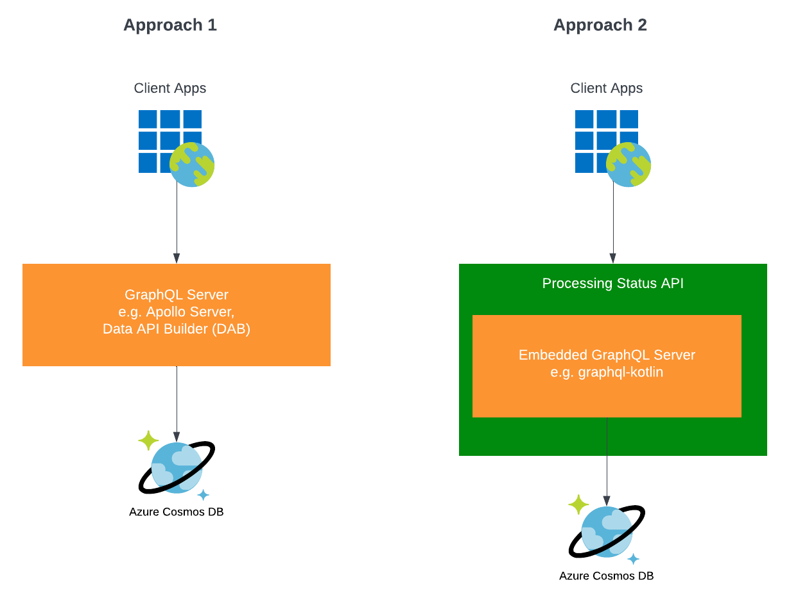

# GraphQL and the Processing Status API

## Overview
*"GraphQL is a query language for APIs and a runtime for fulfilling those queries with your existing data. GraphQL provides a complete and understandable description of the data in your API, gives clients the power to ask for exactly what they need and nothing more, makes it easier to evolve APIs over time, and enables powerful developer tools."* -[graphql.org](https://graphql.org/)

There are a considerable number of queries that are needed for the PS API.  Each user of the PS API has unqiue queries they'd like to have.  Currently, the PS API provides traditional REST endpoints.  As the number of users of PS API grows, so too will the number of unique queries needed to fulfill the needs of those users.  Rather than continue to add new queries to PS API as needs arise, GraphQL would allow users to create their own queries.  [GraphQL versus REST](https://graphapi.com/learn/graphql/vs-rest/) provides a nice comparison of the two.

In addition, GraphQL provides *Subscriptions*, which are a way to get asynchronous notifications.  GraphQL subscriptions could help simplify *some* of the PS API Notifications functionality.  However, GraphQL subscriptions are invoked in response to a mutation or change in data so this only helps with a subset of the PS API Notifications use cases.

There are at least two approaches that can be used to implement GraphQL for the Processing Status API.  **Approach 1** is to have an independent and dedicated GraphQL server that interacts directly with the data source, namely CosmosDB.  **Approach 2** is to use a GraphQL library that is embedded in the PS API.



The advantages of each approach is as follows:

| Independent GraphQL Server (Approach 1) | Embedded GraphQL Server (Approach 2) |
| --------------------------------------- | ------------------------------------ |
| 1. Mature rich products available       | 1. Fewer cloud resources to manage   |
| 2. Decouples queries from ingestion     | 2. Shared resources; e.g. security management |

### GraphQL Requirements
- Must be able to provide fine access control through JWT tokens passed in the HTTP header.
- The GraphQL implementation must be able to expose stored procedures, not just tables and views.
- GraphQL queries must be performant and introduce little to no additional latency when compared to HTTP queries through the existing REST PS API.

## Test Platforms
One or more of each of the two approaches will be examined.

### Data API Builder
The [Data API Builder (DAB)](https://learn.microsoft.com/en-us/azure/data-api-builder/overview) is a Mirosoft product.  The Data API builder "generates modern REST and GraphQL endpoints for your Azure Databases. Use Data API builder to securely expose API endpoints so that your data can be accessed using modern techniques from any platform, developer language, or device."

The Data API Builder is a fairly new product and is only on release 0.10.23 at the time of this writing.  The github page for it can be found [here](https://github.com/Azure/data-api-builder).

#### Configuration generation commands
**Step 1**: Initialize the DAB configuration file.
```bash
dab init --database-type cosmosdb_nosql --graphql-schema schema.gql --cosmosdb_nosql-database ProcessingStatus --connection-string "{{place here}}"
--host-mode "Development"
```

**Step 2**: Add the Reports container to the config.
```bash
dab add Report --source Reports --permissions "anonymous:*"
```

**Step 3**: Attempt to add a stored procedure.
```bash
dab add GetMetadataReports --source dbo.test2 --source.type "stored-procedure" source.params "searchType:s" --permissions "anonymous:execute" --rest.methods "get" --graphql.operation "query"
```

**Step 4**: Start the Data API builder.
```bash
dab start
```

#### Testing with Postman
**POST** `https://localhost:5001/graphql`.
Change request body type to GraphQL and paste the following:
```graphql
{
    reports(first: 5) {
        items {
            id
            uploadId
            reportId
            dataStreamId
            dataStreamRoute
            stageName
            timestamp
            content {
                schema_name
                schema_version
            }
        }
    }
}
```

#### GraphQL Schema
**schema.gql**:
```graphql
type Report @model {
  id: ID
  uploadId: String
  reportId: String
  dataStreamId: String
  dataStreamRoute: String
  stageName: String
  timestamp: Long
  contentType: String
  content: JsonContent
}
 
type JsonContent {
  schema_name: String
  schema_version: String
}

type GetMetadataReports {
  counter: Int
}
```

#### Deployment of Data API Builder
See [Data API Builder on Azure Container Instances](https://www.linkedin.com/pulse/data-api-builder-azur-container-instances-chand-abdul-salam/).  In particular, see the section, *Run Data API builder in Azure Container Instances*.  Also see this article, [how to run DAB in an ACI](https://learn.microsoft.com/en-us/azure/data-api-builder/how-to-run-container).

### Apollo Server
*"Apollo Server is an open-source, spec-compliant GraphQL server that's compatible with any GraphQL client, including Apollo Client. It's the best way to build a production-ready, self-documenting GraphQL API that can use data from any source."* -[apollographql.com](https://www.apollographql.com/docs/apollo-server/)

#### Local setup

##### Step 1: Apollo server base install
Follow the setup instructions found [here](https://www.apollographql.com/docs/apollo-server/v2/getting-started).

##### Step 2: Install Apollo datasource for Cosmos DB
See [Apollo datasource for Cosmos DB](https://github.com/andrejpk/apollo-datasource-cosmosdb)

Execute the following:
```bash
npm install apollo-server graphql
npm install apollo-datasource-cosmosdb
```

[Apollo setup with typescript](https://deepak-v.medium.com/build-a-scalable-graphql-server-using-typescript-and-apollo-server-4c116ed1425e)

##### Step 3: Execute stored procedures with GraphQL
See [Execute stored procedure with GraphQL](https://stackoverflow.com/questions/73944424/execute-stored-procedure-with-graphql), which defines how a resolver might look for Apollo.
```js
const resolvers = {
  Query: {
    executeGetMetadataReports() {  
      return cosmosdb.execute('select get_metadata_reports();');
    }
  }
}
```

##### Step 4: Create a .env file
```
PORT=4000

COSMOS_DB_ENDPOINT={{insert here}}
COSMOS_DB_KEY={{insert here}}

JWT_SECRET={{insert here}}
```

For exposing stored procedures in GraphQL, see [Using TypeScript to write Cosmos DB stored procedures with async/await](https://thomaslevesque.com/2019/07/15/using-typescript-to-write-cosmos-db-stored-procedures-with-async-await/).

#### Unions and interfaces
https://www.apollographql.com/docs/apollo-server/v3/schema/unions-interfaces

#### Apollo Sandbox
Use [this link](https://studio.apollographql.com/sandbox/explorer) to bring up a very nice web app to submit GraphQL queries.

#### Postman
**GET** `http://localhost:4000`.
Change request body type to GraphQL and paste the following:
```graphql
query GetReport {
  report(id: "1cc09043-0ba6-4e83-97eb-7bae13b79f5f") {
    id
    uploadId
    reportId
    dataStreamId
    dataStreamRoute
    stageName
    timestamp
    contentType
  }
}
```

#### Deployment of Apollo Server
See [Deploy Apollo Server as an Azure Function App](https://www.apollographql.com/docs/apollo-server/v3/deployment/azure-functions/)

#### Generate code from GraphQL schema
https://the-guild.dev/graphql/codegen

#### Apollo License
Apollo is licensed under [Elastic License v2 (ELv2)](https://www.elastic.co/licensing/elastic-license).  See [Apollo License](https://www.apollographql.com/docs/resources/elastic-license-v2-faq/).

#### Apollo Server remaining activities
- [x] Get unions working for different report types
- [x] Get array of reports returned
- [x] Pass parameter(s) to queries
- [x] Get (first:n) and (offset:n) working for pagination
- [x] Implement a security example using a JWT
- [ ] Retrieve metadata as dynamic map
- [ ] Get sorting working
- [ ] Test subscriptions to mutations
- [x] One or two "real world" examples of Portal needs (e.g. a where clause or two) 

### GraphQL Kotlin
[GraphQL Kotlin](https://opensource.expediagroup.com/graphql-kotlin/docs/) is a collection of libraries, built on top of graphql-java, that simplify running GraphQL clients and servers in Kotlin.  The idea behind using graphql-kotlin over a server is to explore the pros and cons of having an embedded GraphQL server over an independent one, which is described as approach 2 above.

There are two ways to use graphql-kotlin.  The first way is to use one of the two frameworks that tightly integrate graphql-kotlin.  The other way is a more manual process using the core components of graphql-kotlin to build out the functionality in whatever server platform you choose.

The two frameworks available are [Spring](https://spring.io/) and [Ktor](https://ktor.io/).  Spring is very mature and well supported, but is slow to boot, more complex than other microservice frameworks, and a resource hog.  Ktor is lighter weight in terms of code, faster to boot, and less resource intensive, and has been around since 2017.  The [Spring Server for GraphQL Kotlin](https://opensource.expediagroup.com/graphql-kotlin/docs/server/spring-server/spring-overview) was started in Sep 2019 and the [GraphQL Ktor Plugin](https://opensource.expediagroup.com/graphql-kotlin/docs/server/ktor-server/ktor-overview) in Aug 2020.

Ktor was chosen to be used in this spike given the simplicity to get started, developer reviews and suggestions, as well as for the performance reasons mentioned above.

#### GraphQL for Ktor Implementation
After creating a shell Ktor microservice, the following steps were taken.
- Added [Koin](https://insert-koin.io/) for dependency injection
- Created a Ktor plugin for Azure service bus and tested receiving messages
- Implemented a GraphQL data loader for searching and batching large requests
- Add an *Interface* for the Report `content` field, identical to what was done for Apollo for managing different report types and the different fields within each.
- Enabled the embedded [GraphiQL]https://github.com/graphql/graphiql() library, which provides a nice web interface for discovering HraphQL schemas and running queries.  When running locally, the GraphiQL is available [here](http://localhost:8080/graphiql).

## Next Steps
- Evaluate other open-source GraphQL server solutions?  So far, not able to find any other platformss outside of Apollo that are mature and support NoSQL.  At the time of this writing, other popular GraphQL server platforms like Hasura, Prisma, and Graphile don't appear to work with NoSQL DBs like MongoDB or CosmosDB.
- Evaluate graphql-kotlin (approach 2)
- Deploy solution to Azure
- Test [Import a GraphQL API](https://learn.microsoft.com/en-us/azure/api-management/graphql-api?tabs=portal) into the APIM
- Test query performance
- Add/test DateScalars so timestamps aren't shown as an epoch long integer value
- Verify that undetermininic key/value pairs for metadata can be implemented.  This is challenging since gql is strongly typed.
- Create an Architecture Decision Record (ADR) to justify and explain the shift to include GraphQL for PS API
